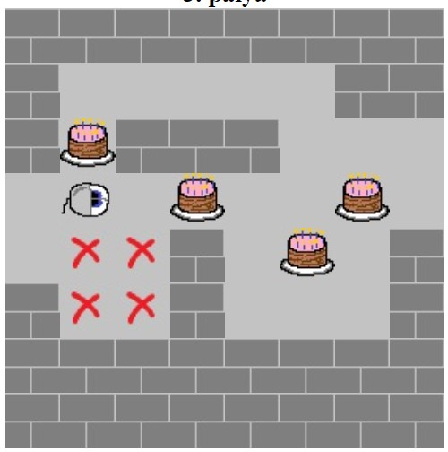
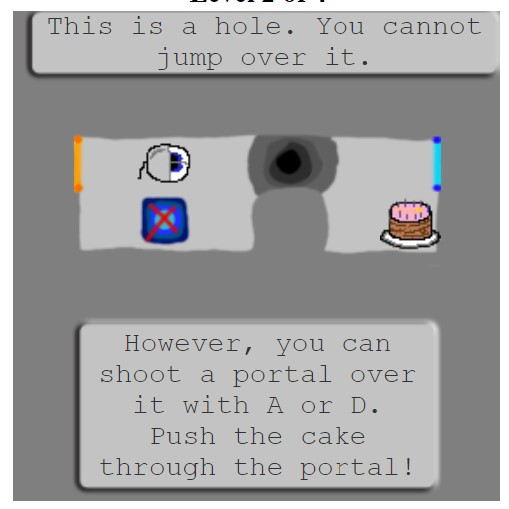
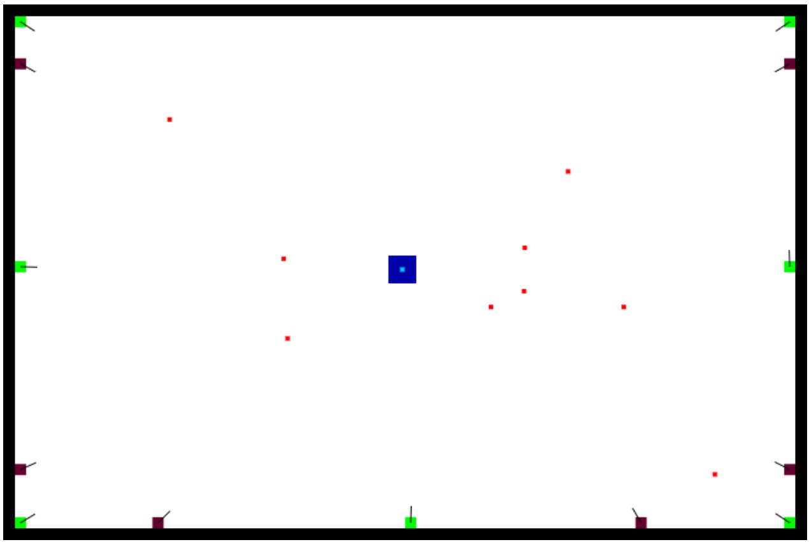
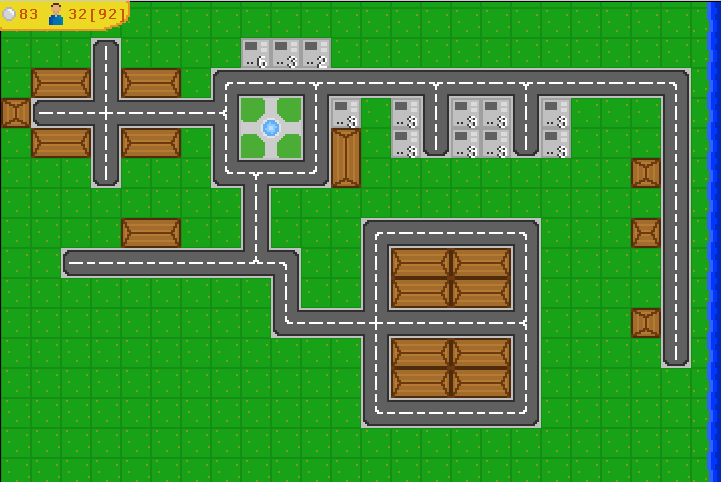
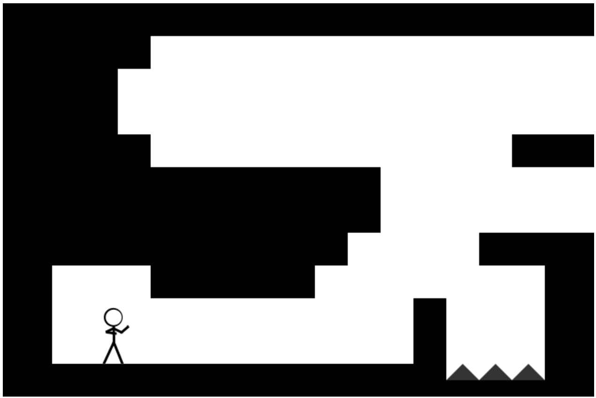
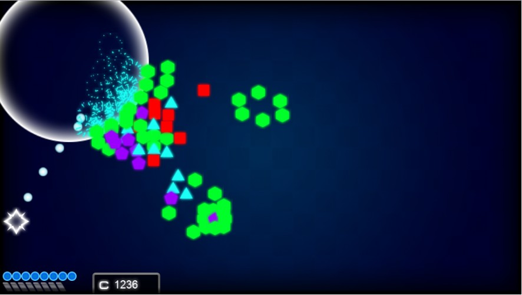
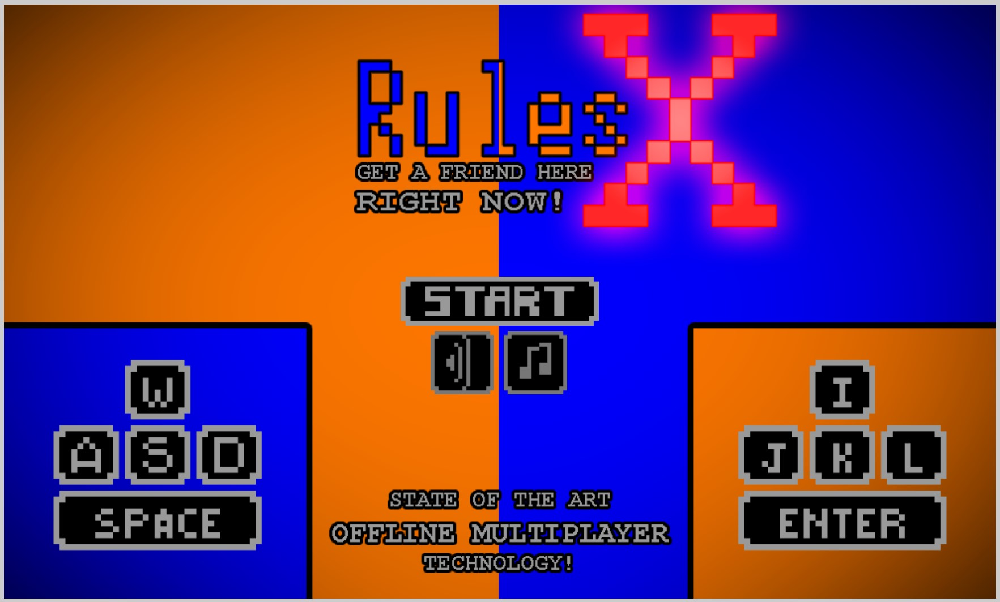
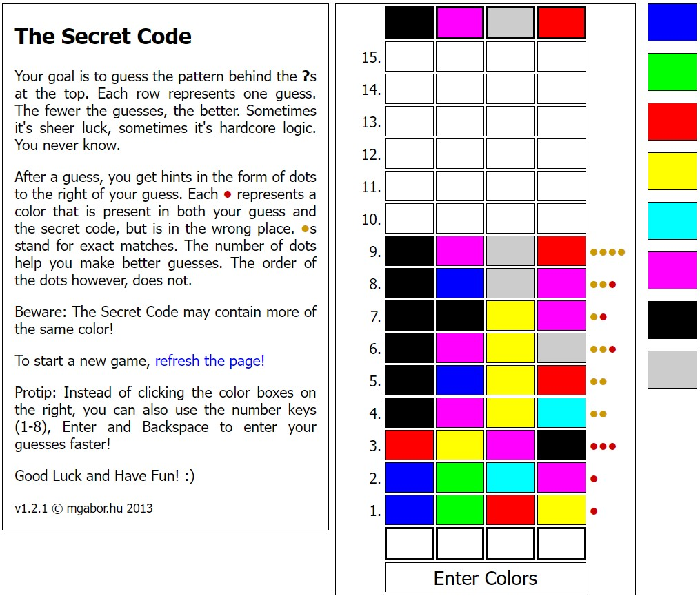
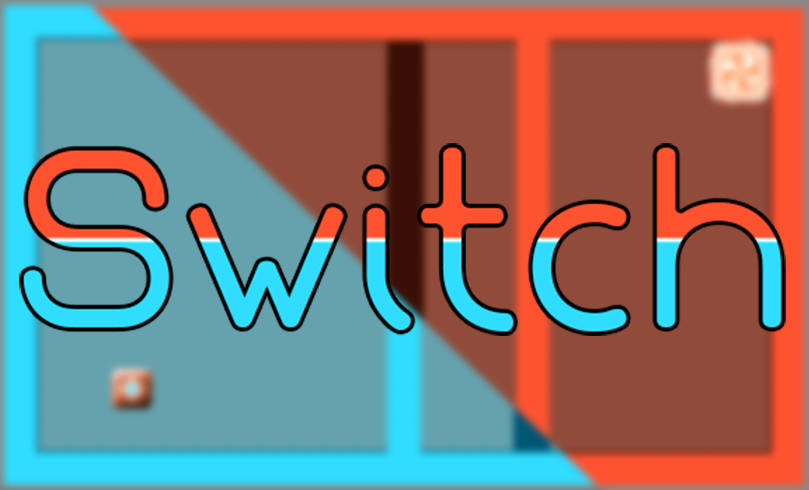

# Early Games

An archive of some of the many small games I made 2011-2014.

Some of these games were created for the [Ludum Dare](https://ldjam.com) 48 hour game jam.
Check the linked LD page of these games to see their competition scores, more screenshots and some nice comments.

## Tortaminátor
_September 2011_

A remake of another sokoban game called ["Cheese Terminator"](https://people.inf.elte.hu/hotsaai/Web2bead/SajtTerminator/)
featuring cake instead of cheese. Arguably improved by adding portals to in a sequel.
There are edge cases with portals where cake can get deleted,
in those cases the mouse ate them according to the lore.

[Tortaminátor](https://mgabor3141.github.io/early-games/Tortaminátor/) 
[Tortaminátor 2 (now with portals!)](https://mgabor3141.github.io/early-games/Tortaminátor-2/)

## Avoid the missiles!
_December 2011_

A surprisingly challenging bullet hell game.
Let me know if you can get a high score of over 10 seconds on the hardest difficulty.

[**Play**](https://mgabor3141.github.io/early-games/game/)

## LD23: My Tiny Town
_April 2012_ 
Theme: Tiny World

 

[**Play**](https://mgabor3141.github.io/early-games/LD23/) 
[Ludum Dare Page](https://web.archive.org/web/20170925134156/http://ludumdare.com/compo/ludum-dare-23/?action=preview&uid=8391)

## Rules
_February 2012_

To this day I believe the particle system in this game is one of the most satisfying things I've ever developed.

Controls not listed: 
`W` noclip 
`Q` debug overlay

[**Play**](https://mgabor3141.github.io/early-games/rules/)

## LD24: Geometry
_August 2012_ 
Theme: Evolution

A game similar in both theme and gameplay to Geometry Wars.
Interestingly I hadn't heard of Geometry Wars until one of the LD comments
pointed out the similarity to me.

Don't forget that you can buy upgrades by pressing `Spacebar`!

 

[**Play**](https://mgabor3141.github.io/early-games/geometry/) 
[Ludum Dare Page](https://web.archive.org/web/20170731142933/http://ludumdare.com/compo/ludum-dare-24/?action=preview&uid=8391)

There's even a "making of" timelapse screencapture that's been private on my channel until now: 
[Geometry - Making of a Game in 48 hours [6:05]](https://youtu.be/M8Z44NCiYrU)

## LD27: Rules X
_August 2013_ 
Theme: 10 Seconds

A split keyboard multiplayer sequel to [Rules](#rules) (see above)

 

[**Play**](https://mgabor3141.github.io/early-games/LD27/) 
[Ludum Dare Page](https://web.archive.org/web/20160914200536/http://ludumdare.com/compo/ludum-dare-27/?action=preview&uid=8391)

## The Secret Code
_January 2013_

[**Play**](https://mgabor3141.github.io/early-games/secretcode/)

## LD30: Switch
_August 2014_ 
Theme: Connected Worlds

A simple puzzle game with multidimensional lock and key puzzles and some neat custom animations

 

[**Play**](https://mgabor3141.github.io/early-games/LD30/) 
[Ludum Dare Page](https://web.archive.org/web/20170918021237/http://ludumdare.com/compo/ludum-dare-30/?action=preview&uid=8391)

